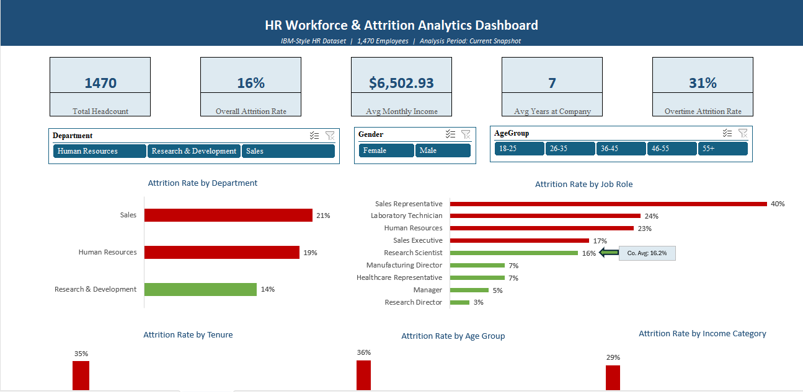
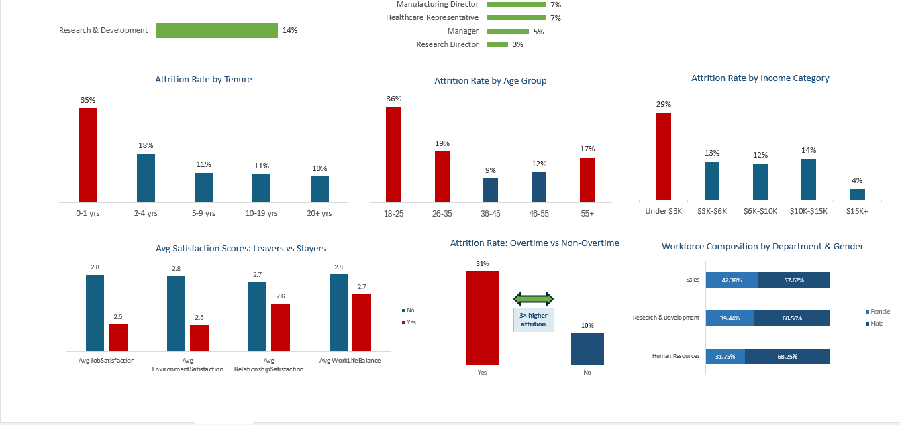

# HR Workforce & Attrition Analytics


A full-cycle HR analytics project built entirely in **Microsoft Excel**, analysing workforce attrition across 1,470 employee records. The project follows the CRISP-DM methodology — from raw data audit through Power Query cleaning, PivotTable-driven exploratory analysis, an interactive slicer dashboard, and a boardroom-ready insights narrative.

---

## Dashboard Preview





---

## The Business Problem

The organisation is losing **16.2% of its workforce annually** — above the 10–15% industry benchmark for stable organisations. Across 1,470 employees, 238 left in the observed period. At a conservative replacement cost of 50% of annual salary, this represents approximately **$9.3M in preventable annual expenditure**.

This project identifies *where* the attrition is concentrated, *when* employees are most at risk, and *why* they are leaving — then translates those findings into a prioritised four-action retention strategy.

---

## Key Findings

| Finding | Insight |
|---|---|
| 🔴 **Overtime = 3× attrition risk** | Employees on overtime leave at 31% vs 10% for those who don't |
| 🔴 **Sales Representative = highest-risk role** | 40% attrition — 2.5× the company average |
| 🔴 **Year-one employees most vulnerable** | 35% attrition in 0–1 yr band — the steepest tenure cliff |
| 🔴 **18–25 age group leads departures** | 36% attrition — pointing to an early-career engagement gap |
| 🔴 **Pay gradient confirmed** | Under $3K band: 29% attrition vs $15K+: just 4% |
| 🟡 **Satisfaction gap consistent** | Leavers scored lower on all 4 satisfaction metrics |
| 🟢 **R&D most stable department** | 14% — only department below the company average |

---

## Project Structure

```
hr-attrition-analytics/
│
├── HR_Attrition_Analyses_and_Dashboard.xlsx   ← Completed project workbook
│
├── data/
│   └── HR_Analytics.csv                       ← Original source dataset (1,480 rows)
│
├── docs/
│   ├── data_dictionary.md                     ← Column definitions and notes
│   ├── data_quality_log.md                    ← Issues found and actions taken
│   └── methodology.md                         ← CRISP-DM phase walkthrough
│
├── insights/
│   ├── executive_summary.md                   ← Boardroom-ready one-page summary
│   └── full_narrative.md                      ← Complete findings + recommendations
│
└── assets/
    ├── dashboard_overview.png                 ← Dashboard screenshot (full view)
    └── dashboard_charts.png                   ← Dashboard screenshot (charts detail)
```

---

## Workbook Structure

The Excel workbook contains five sheets:

| Sheet | Purpose |
|---|---|
| `README` | Project roadmap and workbook navigation guide |
| `Raw Data` | Unmodified 1,480-row import — audit trail, do not edit |
| `Cleaned Data` | 1,470-row working table with 4 derived formula columns |
| `Data Dictionary` | Definition of every column including derived fields |
| `Data Quality Log` | Documented issues, actions taken, and caveats |
| `Pivot Tables` | 10 PivotTables feeding all dashboard charts |
| `Dashboard` | Single-screen interactive dashboard with slicers |

---

## Analytical Approach

### Phase 1 — Data Preparation
- Audited 38 columns across 1,480 records
- Removed 10 duplicate employee records via Power Query → deduplicate on EmpID (1,480 → 1,470)
- Cleaned `MonthlyIncome` from text (`$5,993.00`) to numeric using `VALUE` + `SUBSTITUTE` formulas
- Dropped 3 constant columns (`EmployeeCount`, `Over18`, `StandardHours`)
- Documented 57 missing values in `YearsWithCurrManager` — retained as blank
- Added 4 derived columns: `AttritionFlag` (1/0), `OverTimeFlag` (1/0), `TenureBand`, `IncomeCategory`

### Phase 2 — Exploratory Analysis (10 PivotTables)

| # | PivotTable | Key Question |
|---|---|---|
| 1 | PT_OverallAttrition | What is the baseline rate? |
| 2 | PT_ByDept | Where is attrition highest? |
| 3 | PT_ByOvertime | How much does overtime increase risk? |
| 4 | PT_ByRole | Which roles are most vulnerable? |
| 5 | PT_ByTenure | When do employees leave? |
| 6 | PT_IncomeByRole | What is pay distribution across roles? |
| 7 | PT_IncomeVsAttrition | Does higher pay reduce attrition? |
| 8 | PT_SatisfactionByAttrition | Did leavers score lower on satisfaction? |
| 9 | PT_Demographics | What is the workforce composition? |
| 10 | PT_AgeVsAttrition | Which career stage is highest risk? |

**Key technique:** `AttritionFlag` (1/0) summarised as **Average** in all PivotTables — produces true attrition rates using each group's own headcount as denominator. Consistency check: every PivotTable's Grand Total = 16.2%.

### Phase 3 — Interactive Dashboard
- **5 KPI cards:** Total Headcount · Attrition Rate · Avg Monthly Income · Avg Tenure · OT Attrition Rate
- **8 charts** connected live to PivotTables
- **3 slicers** (Department, Gender, AgeGroup) connected to all 10 PivotTables simultaneously
- Colour coding: bars **above** company average (16.2%) → red; **below** → green
- Company average annotation callout on Job Role chart
- Protected sheet — slicers remain interactive, data cannot be accidentally edited

### Phase 4 — Insights Narrative
- 6 structured findings following the What → How Bad → Why → So What pyramid
- 4 prioritised recommendations with expected business impact
- Boardroom 3-minute presentation script
- Full analytical caveats documented

---

## Recommendations (Priority Order)

| Priority | Action | Timeline | Impact |
|---|---|---|---|
| 1 | Audit and redistribute overtime in Sales | 0–3 months | Reduce 31% OT attrition rate |
| 2 | Redesign the 0–90 day onboarding experience | 3–6 months | Reduce 35% year-one attrition |
| 3 | Benchmark entry-level compensation vs market | 6–12 months | Reduce Under $3K band attrition (29%) |
| 4 | Implement quarterly satisfaction pulse surveys | Ongoing | Convert attrition from lagging to leading indicator |

---

## Dataset

| Attribute | Detail |
|---|---|
| Source | IBM HR Analytics Employee Attrition dataset (publicly available, adapted) |
| Original rows | 1,480 |
| Cleaned rows | 1,470 (10 duplicates removed) |
| Columns | 38 original + 4 derived |
| Target variable | `Attrition` (Yes/No) — 16.2% positive rate |

---

## Tools & Techniques

| Tool | Application |
|---|---|
| Excel — Power Query | Structural cleaning: dedup, type conversion, column removal |
| Excel — PivotTables | 10 analytical pivots using Average of 1/0 flag for rate calculation |
| Excel — Charts | 8 charts with threshold colour-coding and annotation |
| Excel — Formulas | KPI cards (COUNTA, AVERAGE, AVERAGEIF), derived columns (nested IF, VALUE, SUBSTITUTE) |
| Excel — Slicers | 3 interactive slicers connected to all 10 PivotTables via Report Connections |

---

## Author

**Raji Toluwanimi Samuel**
Healthcare Data Analyst & M&E Specialist · Abuja, Nigeria

[](https://linkedin.com/in/)
[](https://github.com/)

---

## License

This project uses a publicly available dataset for portfolio and educational purposes.
